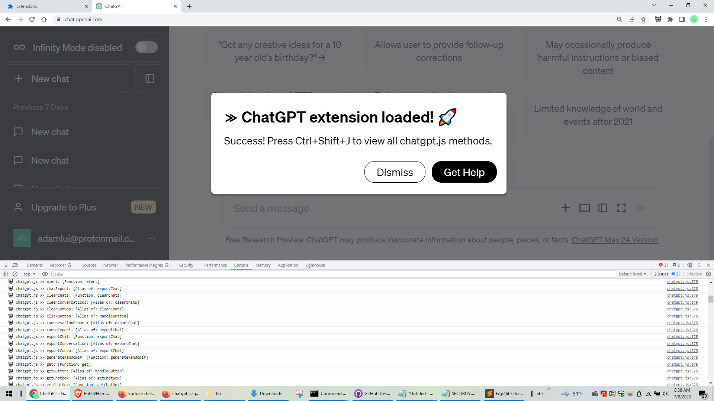
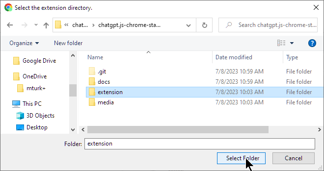
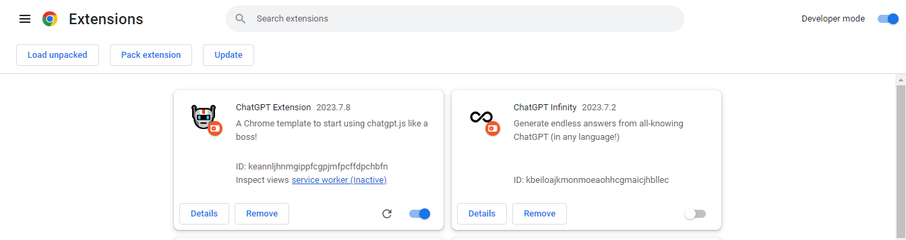
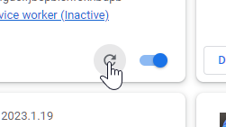

    <h6>
        <picture>
            <source type="image/svg+xml" media="(prefers-color-scheme: dark)" srcset="https://assets.chatgptjs.org/images/icons/earth/white/icon32.svg?v=e638eac">
           
        </picture>
        &nbsp;한국인 |
        <a href="../..#readme">English</a> |
        <a href="../zh-cn#readme">简体中文</a> |
        <a href="../zh-tw#readme">繁體中文</a> |
        <a href="../ja#readme">日本</a> |
        <a href="../hi#readme">हिंदी</a> |
        <a href="../de#readme">Deutsch</a> |
        <a href="../es#readme">Español</a> |
        <a href="../fr#readme">Français</a> |
        <a href="../it#readme">Italiano</a> |
        <a href="../nl#readme">Nederlands</a> |
        <a href="../pt#readme">Português</a> |
        <a href="../vi#readme">Việt</a>
    </h6>

#  chatgpt.js-chrome-starter

<h3><a href="https://github.com/KudoAI/chatgpt.js">chatgpt.js</a> 를 사용하여 나만의 Chrome 확장 프로그램을 개발하기 위한 출발점</h3>

 

## ⚡ 설치

1. 딸깍 하는 소리 **Fork** -또는- **Use this template** > **Create a new repository** ~에 https://github.com/KudoAI/chatgpt.js-chrome-starter

2. **Clone** 로컬에서 새로 생성된 저장소

3. Chrome (또는 모든 Chromium 브라우저) 에서 `chrome://extensions` 를 방문합니다

4. **Developer mode** 토글이 활성화되어 있는지 확인합니다 

5. 딸깍 하는 소리 **Load unpacked**  

 

6. 팝업 창에서 **extension** 폴더를 선택합니다 > 딸깍 하는 소리 **Select Folder**   
  

그게 다야! **ChatGPT Extension** 이 이제 확장 목록에 나타납니다:

 

 

**💡 조언:** _소스 코드의 변경 사항을 반영하려면 확장 프로그램 타일에서 **다시 로드**를 클릭하고 확장 프로그램 스크립트가 실행 중인 모든 Chrome 탭을 다시 로드합니다:_

 

 

_고급 Chrome API 메서드에 대한 자세한 내용은 https://developer.chrome.com/docs/extensions/reference/api 를 참조하세요_

## 🤖 chatgpt.js 로 제작

다음은 chatgpt.js를 사용하는 Google의 확장 프로그램 중 일부입니다:

 

 

#

<a href="https://github.com/KudoAI/chatgpt.js-chrome-starter/issues">도움 받기</a> / <a href="#top">맨 위로 ↑</a>
