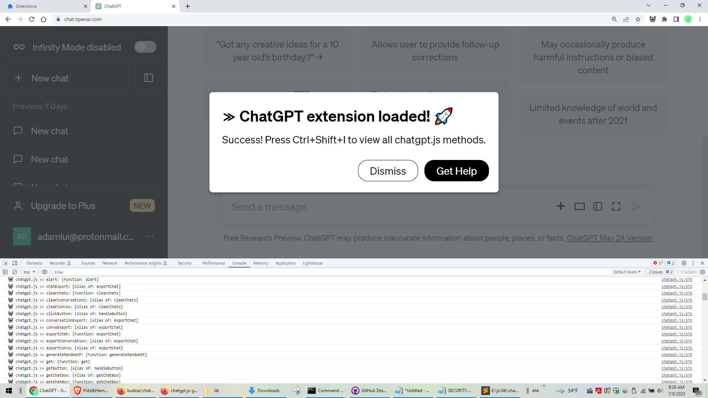
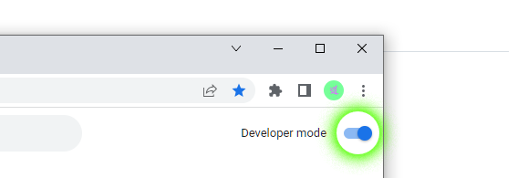
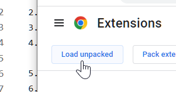
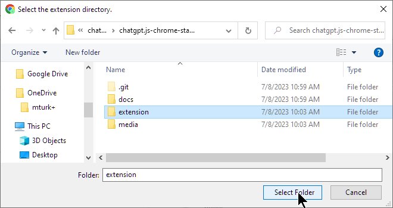
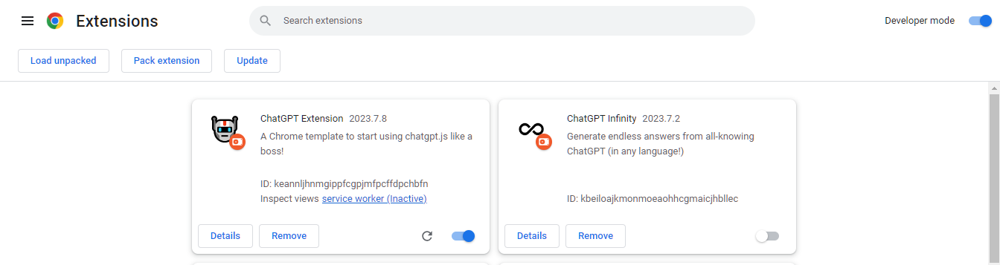
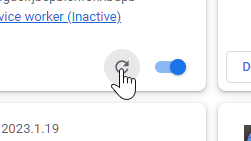
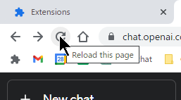

######  Nederlands | <a href="../..#readme">English</a> | <a href="../zh-cn#readme">简体中文</a> | <a href="../zh-tw#readme">繁體中文</a> | <a href="../ja#readme">日本</a> | <a href="../ko#readme">한국인</a> | <a href="../hi#readme">हिंदी</a> | <a href="../de#readme">Deutsch</a> | <a href="../es#readme">Español</a> | <a href="../fr#readme">Français</a> | <a href="../it#readme">Italiano</a> | <a href="../pt#readme">Português</a> | <a href="../vi#readme">Việt</a>

# chatgpt.js-chrome-starter

<h3> Een startpunt voor het ontwikkelen van uw eigen Chrome-extensie met behulp van <a href="https://github.com/kudoai/chatgpt.js">chatgpt.js</a></h3>

 

<picture>
    <source type="image/webp" srcset="../../media/images/screenshots/extension-loaded.webp">
    
</picture>

## ⚡ Installatie

1. Klik **Fork** -of- **Use this template** > **Create a new repository** op https://github.com/kudoai/chatgpt.js-chrome-starter

2. **Clone** uw nieuw gemaakte repo lokaal

3. Ga naar `chrome://extensions` in Chrome (of een andere Chromium-browser)

4. Zorg ervoor dat de schakelaar **Developer mode** is geactiveerd 

5. Klik **Load unpacked**  

 

6. Selecteer in het pop-upvenster de map **extension** > klik **Select Folder**   
  

Dat is het! **ChatGPT Extension** verschijnt nu in de extensielijst:

 

 

**💡 TIP:** _Om wijzigingen in de broncode weer te geven, klikt u op **Opnieuw laden** op de extensietegel + laadt u alle Chrome-tabbladextensiescripts opnieuw waarop wordt uitgevoerd:_

 

 

## 🤖 Gemaakt met chatgpt.js

Dit zijn enkele van de extensies van Google die chatgpt.js gebruiken:

 

 

#

<a href="https://github.com/kudoai/chatgpt.js-chrome-starter/issues">Hulp krijgen</a> / <a href="#">Terug naar boven ↑</a>
