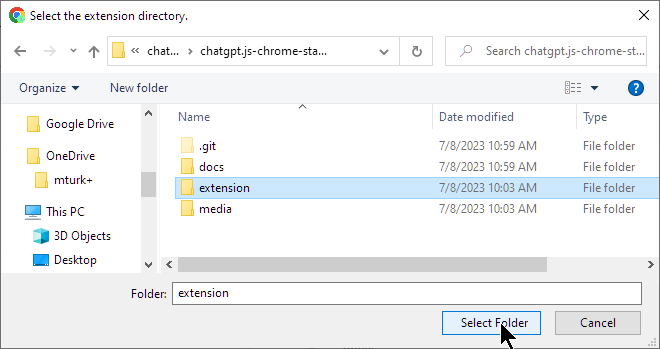
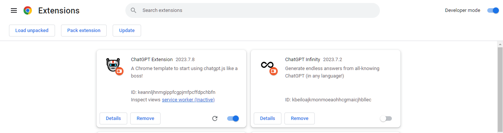
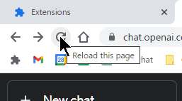

    <h6>
        <picture>
            <source type="image/svg+xml" media="(prefers-color-scheme: dark)" srcset="https://assets.chatgptjs.org/images/icons/earth/white/icon32.svg?v=e638eac">
           
        </picture>
        &nbsp;Português |
        <a href="../..#readme">English</a> |
        <a href="../zh-cn#readme">简体中文</a> |
        <a href="../zh-tw#readme">繁體中文</a> |
        <a href="../ja#readme">日本</a> |
        <a href="../ko#readme">한국인</a> |
        <a href="../hi#readme">हिंदी</a> |
        <a href="../de#readme">Deutsch</a> |
        <a href="../es#readme">Español</a> |
        <a href="../fr#readme">Français</a> |
        <a href="../it#readme">Italiano</a> |
        <a href="../nl#readme">Nederlands</a> |
        <a href="../vi#readme">Việt</a>
    </h6>

#  chatgpt.js-chrome-starter

<h3>Um ponto de partida para desenvolver sua própria extensão do Chrome usando <a href="https://github.com/KudoAI/chatgpt.js">chatgpt.js</a></h3>

 

## ⚡ Instalação

1. Clique **Fork** -ou- **Use this template** > **Create a new repository** sobre https://github.com/KudoAI/chatgpt.js-chrome-starter

2. **Clone** seu repositório recém-criado localmente

3. Visite `chrome://extensions` no Chrome (ou qualquer navegador Chromium)

4. Certifique-se de que a alternância **Developer mode** esteja ativada 

5. Clique **Load unpacked**  

 

6. Na janela pop-up, selecione a pasta **extension** > clique **Select Folder**   
  

É isso! **ChatGPT Extension** agora aparecerá na lista de extensões:

 

 

**💡 DICA:** _Para refletir as alterações do código-fonte, clique em **Recarregar** no bloco de extensão + recarregar quaisquer scripts de extensão de guias do Chrome em execução:_

 

 

_Para métodos avançados da API do Chrome, consulte: https://developer.chrome.com/docs/extensions/reference/api_

## 🤖 Feito com chatgpt.js

Estas são algumas das extensões apresentadas pelo Google que usam chatgpt.js:

 

 

#

<a href="https://github.com/KudoAI/chatgpt.js-chrome-starter/issues">Obter ajuda</a> / <a href="#top">De volta ao topo ↑</a>
