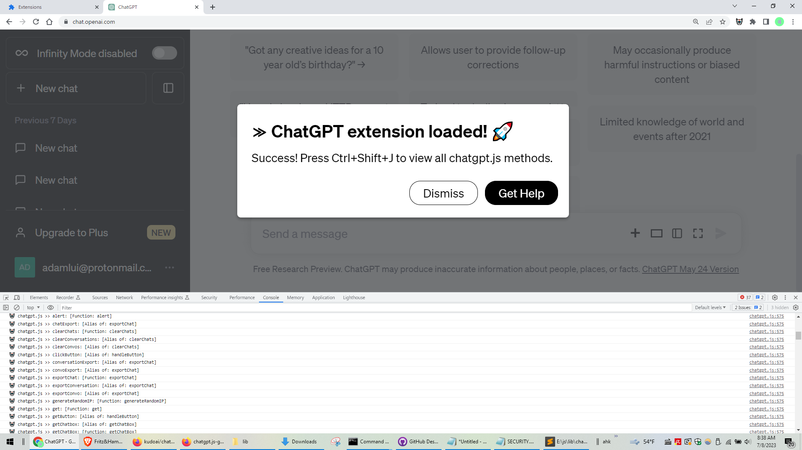
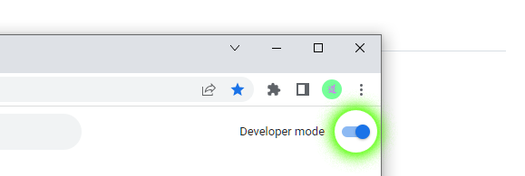
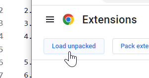
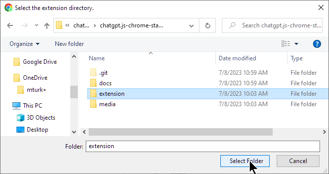
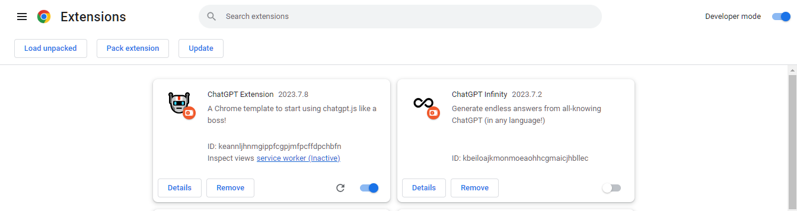
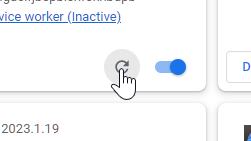
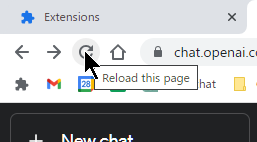

    <h6>
        <picture>
            <source type="image/svg+xml" media="(prefers-color-scheme: dark)" srcset="https://assets.chatgptjs.org/images/icons/earth/white/icon32.svg?v=e638eac">
           
        </picture>
        &nbsp;简体中文 |
        <a href="../..#readme">English</a> |
        <a href="../zh-tw#readme">繁體中文</a> |
        <a href="../ja#readme">日本</a> |
        <a href="../ko#readme">한국인</a> |
        <a href="../hi#readme">हिंदी</a> |
        <a href="../de#readme">Deutsch</a> |
        <a href="../es#readme">Español</a> |
        <a href="../fr#readme">Français</a> |
        <a href="../it#readme">Italiano</a> |
        <a href="../nl#readme">Nederlands</a> |
        <a href="../pt#readme">Português</a> |
        <a href="../vi#readme">Việt</a>
    </h6>

#  chatgpt.js-chrome-starter

<h3>使用 <a href="https://github.com/KudoAI/chatgpt.js">chatgpt.js</a> 开发自己的 Chrome 扩展程序的起点</h3>

 

## ⚡ 安装

1. 点击 **Fork** -或者- **Use this template** > **Create a new repository** 在 https://github.com/KudoAI/chatgpt.js-chrome-starter

2. **Clone** 您在本地新创建的存储库

3. 在 Chrome（或任何 Chromium 浏览器）中访问 `chrome://extensions`

4. 确保 **Developer Mode** 开关已激活 

5. 点击 **Load unpacked**  

 

6. 在弹出窗口中，选择 **extension** 文件夹 > 点击 **Select Folder**   
  

就是这样! **ChatGPT Extension** 现在将出现在扩展列表中:

 

 

**💡 提示:** _反映源代码的更改，请单击扩展程序图块上的**重新加载** + 重新加载任何正在运行的 Chrome 选项卡扩展程序脚本：_

 

 

_有关高级 Chrome API 方法，请参阅：https://developer.chrome.com/docs/extensions/reference/api_

## 🤖 使用 chatgpt.js 制作

以下是 Google 提供的一些使用 chatgpt.js 的扩展:

 

 

#

<a href="https://github.com/KudoAI/chatgpt.js-chrome-starter/issues">得到帮助</a> / <a href="#top">回到顶部 ↑</a>
