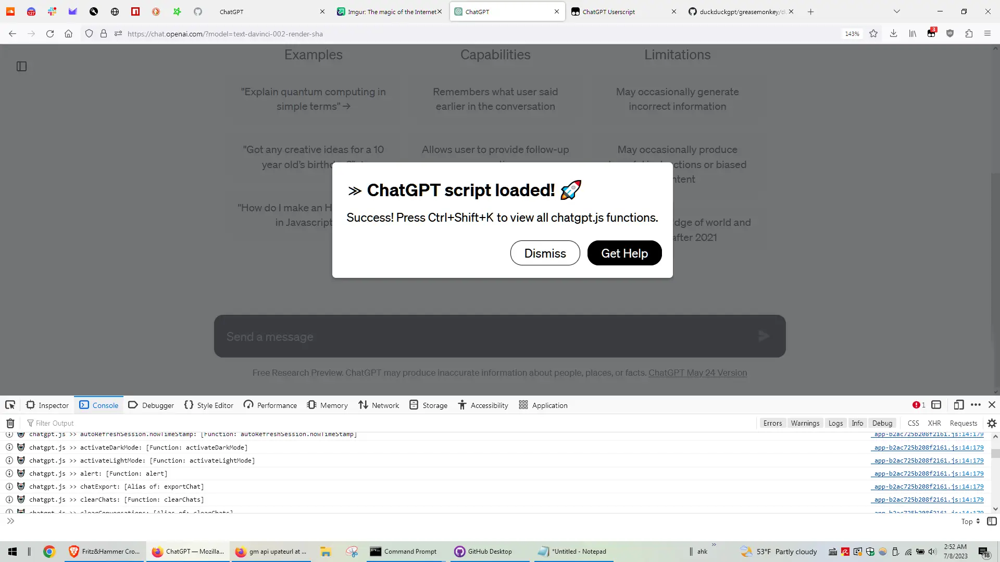

# 🙈 chatgpt.js-greasemonkey-starter

A starting point for developing your own Greasemonkey userscript using [chatgpt.js](https://github.com/kudoai/chatgpt.js)

 

<picture>
    <source type="image/webp" srcset="../media/images/screenshots/chatgpt-userscript-on.webp">
    
</picture>
