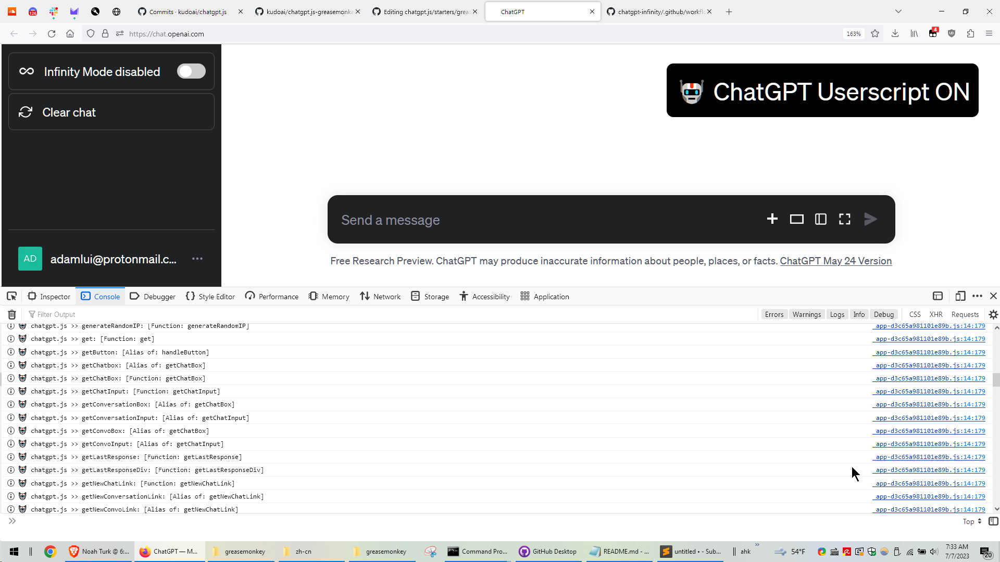

# 🙈 chatgpt.js-greasemonkey-starter

### A starting point for developing your own Greasemonkey userscript using [chatgpt.js](https://github.com/KudoAI/chatgpt.js).

 

_To utilize advanced Greasemonkey API methods, see: https://wiki.greasespot.net/Greasemonkey_Manual:API_
